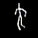

# Spatio-temporal Dance Generation Through Variational Latent Space Interpolation 

Dance AI : High School AP Research

Dance choreography is an art of producing a series of dance movements that matches the beat, tempo and theme of a given piece of music. It is a complicated process that has become an essential part of the modern music industry aimed at maximizing the expression of a song by adding to it a visual element. Creating evocative dance choreographies is an arduous and important task - one that is gaining momentum in the Artificial Intelligence (AI) industry. While there have been significant breakthroughs in the dance generation field, the machine learning models introduced were computationally expensive and required high-end GPUs. In this paper, we propose a Variational Autoencoder + Seq2Seq model combination that occupies up no more than 1 GB in Random Access Memory (RAM). The model analyzes a wide-range of dance movement data and uses its observations to create its own unique choreographies. As a result, the model would be able to create original and difficult dance choreographies while running on the GPU of an average laptop.

Research Presentation : https://www.youtube.com/watch?v=kh0_XZZAoVo

Example of Generated Dance

